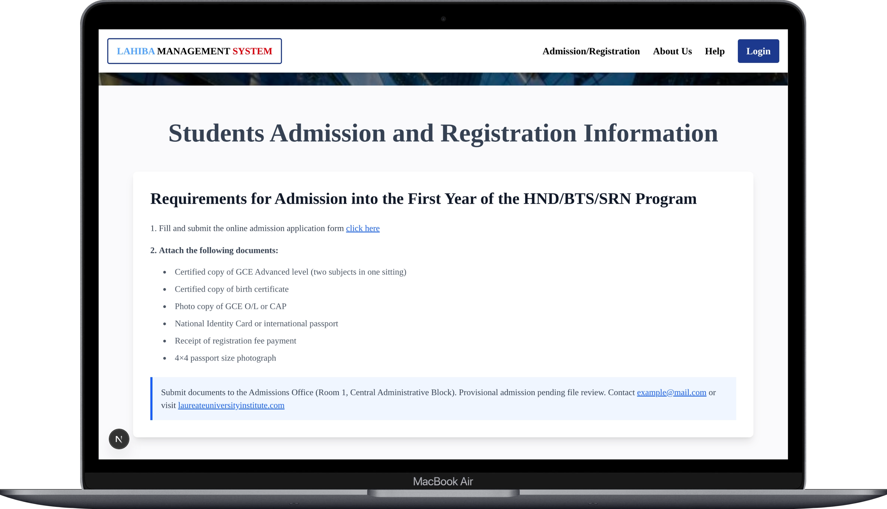
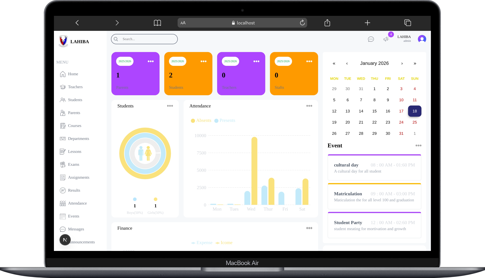

# Next.js Application

This is a modern web application built with **Next.js**, bootstrapped using
[`create-next-app`](https://github.com/vercel/next.js/tree/canary/packages/create-next-app).

The project uses the **App Router**, optimized fonts, and best practices for
performance, SEO, and developer experience.

---

## About the Project

This application is a role-based platform designed to support multiple user
types, including **Admin**, **Teacher**, and **Student**. Each role has access
to its own dashboard and features.

---

## Features

- ⚡ Next.js App Router
- 🔐 Role-based access (Admin, Teacher, Student)
- 🎨 Optimized fonts using `next/font` (Geist)
- 📁 File-based routing
- 🔥 Fast refresh during development
- 🌐 SEO-friendly by default
- 🚀  deployed on Vercel
---

## Tech Stack

- **Framework:** Next.js
- **Language:** JavaScript
- **Styling:** CSS / CSS Modules and Tailwind
- **Fonts:** next/font (Geist)
- **Package Managers:** npm, yarn, pnpm, or bun
- **Deployment:** Vercel

---

## Screenshots

### Home Page


### Admin Dashboard


### Teacher Dashboard


### Student Dashboard


---

## Getting Started
First, run the development server:

```bash
npm run dev
# or
yarn dev
# or
pnpm dev
# or
bun dev
```


### Prerequisites

- Node.js 18.17 or later

---

### Installation

Clone the repository and install dependencies:

```bash
git clone https://github.com/your-username/your-repo-name.git
cd your-repo-name
npm install
